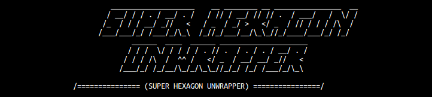
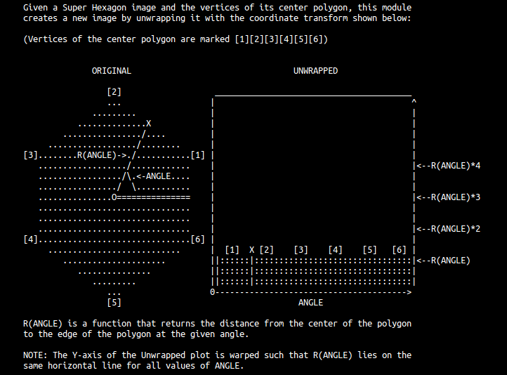
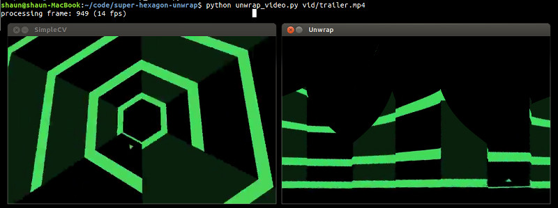

```
Unwrap a video:
> python unwrap_video.py vid/trailer.mp4
```



```
Script options

--help          (show all options)
--start N       (start at frame N)
--stop N        (stop at frame N)
--dumpdir DIR   (dump all frames into the given DIR)
```

```
Dependencies

* Python 2.7
* SimpleCV 1.3     (for video processing and computer vision)
* Pyglet           (for fast image transforms with OpenGL shaders)
```
