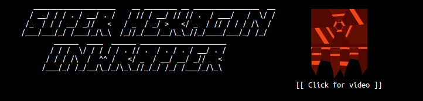

[](https://vimeo.com/78830111)

__Super Hexagon__ (shown below on the left) is a game by Terry Cavanagh.  This
project provides a different perspective for this game (shown below on the
right).  Angular motion is converted into lateral motion, resulting in two
different representations for the same gameplay. (Notice: the limited range of
the original image causes black space in the new broader image).

This project is written in Python.  It employs Computer Vision algorithms
provided by __SimpleCV__ to establish a reference frame in the image.  Then it
employs OpenGL fragment shaders through __Pyglet__ to quickly warp (or
"unwrap") the image.  (See the [code directory](code) for more details.)


```
Unwrap a video:
> python unwrap_video.py vid/trailer.mp4
```


```
Script options

--help          (show all options)
--start N       (start at frame N)
--stop N        (stop at frame N)
--out DIR       (dump all frames into the given DIR)
```

```
Dependencies

* Python 2.7
* SimpleCV 1.3  (for video processing and computer vision)
* Pyglet        (for fast image transforms with OpenGL shaders)
```
