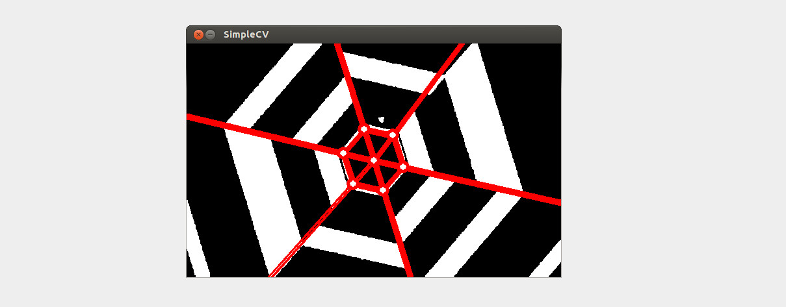
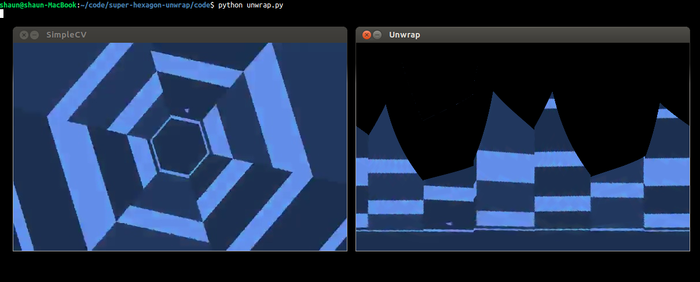
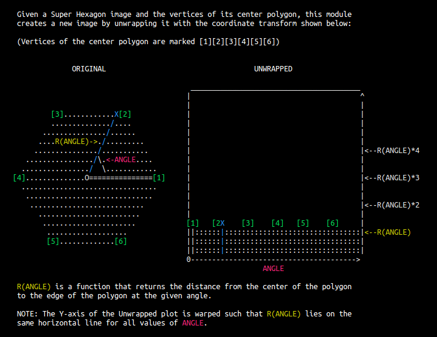

We find the vertices of the center polygon, then extend axis lines from the center
through each vertex.  This creates the sectors of our reference frame that we
will use to unwrap the image.  The following script contains the code that
locates the vertices (commented for your reading).  Running it directly will
parse and display an image for testing.
    
```
Parse a test image:
> python parse.py
```



Once we have the reference frame, we can build a mathematical projection to
unwrap the image such that each of the detected axis lines are made vertical
(math details below). Then we apply it to the image with an OpenGL fragment
shader, which uses GPU acceleration for fast pixel mapping.  (This was a little
awkward to get working because OpenGL is not intended for batch
image-processing.)  The following script contains the code that does this
(commented for your reading).  Running it directly will parse, unwrap, and
display an image for testing.

```
Unwrap a test image:
> python unwrap.py
```



Notice that the projection and can be quite distorted in areas.  This results
from inherent errors in the reference frame and the lack of mathematics in the
projection to account for 3D rotation of the image.  The projection as it is
now assumes that the optical axis is perpendicular to the surface of the game.
The following is an animated excerpt from unwrap.py that describes the math.



